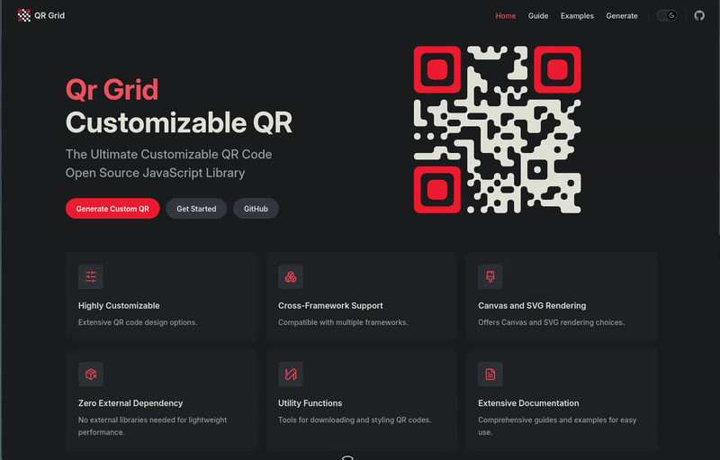

<p align="center">
  <a href="https://github.com/yadav-saurabh/qrGrid#gh-light-mode-only">
    
  </a>
  <a href="https://github.com/yadav-saurabh/qrGrid#gh-dark-mode-only">
    
  </a>
</p>

<p align="center">
  <a href="https://github.com/yadav-saurabh/qrGrid/blob/main/LICENSE"></a>
  <a href="https://www.npmjs.com/package/@qrgrid/core"></a>
  <a href="https://www.npmjs.com/package/@qrgrid/react"></a>
  <a href="https://www.npmjs.com/package/@qrgrid/vue"></a>
  <a href="https://www.npmjs.com/package/@qrgrid/angular"></a>
  <a href="https://www.npmjs.com/package/@qrgrid/styles"></a>
  <a href="https://www.npmjs.com/package/@qrgrid/cli"></a>
  <a href="https://www.npmjs.com/package/@qrgrid/server"></a>
</p>

<p align="center">
  <a href="https://www.qrgrid.dev/"><strong>Docs</strong></a> &nbsp;&bull;&nbsp;
  <a href="https://www.qrgrid.dev/generate"><strong>Try it</strong></a> &nbsp;&bull;&nbsp;
  <a href="https://www.qrgrid.dev/examples"><strong>Examples</strong></a>
</p>

---

## Why this exists

Most QR code libraries give you a black-and-white square and call it done. Want rounded dots, a gradient, your logo in the center, or different colors for the finder patterns? Suddenly you're fighting the library, patching around its internals, or stacking wrappers on top of wrappers.

QR Grid does things differently. The core hands you raw QR data as a simple array of 1s and 0s. You render it however you want: a plain `<canvas>`, an `<svg>`, a WebGL shader, a PDF, a terminal. No opinions about rendering, no framework lock-in. If you happen to use React, Vue, or Angular, there are native components for those too.

The entire QR encoding is written from scratch in TypeScript. Reed-Solomon error correction, Dijkstra-optimized segment encoding, all 40 QR versions. Zero runtime dependencies.

## See it in action

<p align="center">
  
</p>

Play with colors, shapes, error correction, and logo embedding in real time at **[qrgrid.dev/generate](https://www.qrgrid.dev/generate)**.

## How to use it

### With plain HTML and a `<canvas>`

The most flexible approach. No framework needed, just a bundler that handles npm imports. You get the raw QR data and draw it yourself.

```bash
npm install @qrgrid/core
```

```html
<canvas id="qr" width="400" height="400"></canvas>
```

```js
import { QR } from "@qrgrid/core";

const qr = new QR("https://qrgrid.com");
const canvas = document.getElementById("qr");
const ctx = canvas.getContext("2d");

// figure out how big each module should be
const size = Math.floor(400 / (qr.gridSize + 1.5));
const border = Math.ceil(size * qr.gridSize - 400) + size * 2;
canvas.height = 400 + border;
canvas.width = 400 + border;

// draw every dark module
ctx.fillStyle = "black";
let x = size,
  y = size;
for (let i = 0; i < qr.data.length; i++) {
  if (qr.data[i]) {
    ctx.fillRect(x, y, size, size);
  }
  x += size;
  if (i % qr.gridSize === qr.gridSize - 1) {
    x = size;
    y += size;
  }
}

// fill the background behind everything
ctx.globalCompositeOperation = "destination-over";
ctx.fillStyle = "white";
ctx.fillRect(0, 0, canvas.width, canvas.height);
```

That's it. `qr.data` is a flat `Uint8Array` where `1` means dark and `0` means light. The grid is `qr.gridSize` x `qr.gridSize`. You decide what "dark" looks like.

### With plain HTML and an `<svg>`

Same idea, different output. Build up an SVG path string and set it on a `<path>` element.

```html
<svg id="qrSvg" xmlns="http://www.w3.org/2000/svg">
  <path id="qrPath" />
</svg>
```

```js
import { QR } from "@qrgrid/core";

const qr = new QR("https://qrgrid.com");
const svg = document.getElementById("qrSvg");
const pathEl = document.getElementById("qrPath");

const size = Math.floor(400 / (qr.gridSize + 1.5));
const border = Math.ceil(size * qr.gridSize - 400) + size * 2;
const total = 400 + border;

svg.setAttribute("width", total);
svg.setAttribute("height", total);
svg.setAttribute("viewBox", `0 0 ${total} ${total}`);
svg.style.background = "white";

let x = size,
  y = size,
  d = "";
for (let i = 0; i < qr.data.length; i++) {
  if (qr.data[i]) {
    d += `M${x} ${y}v${size}h${size}v-${size}z`;
  }
  x += size;
  if (i % qr.gridSize === qr.gridSize - 1) {
    x = size;
    y += size;
  }
}

pathEl.setAttribute("d", d);
pathEl.setAttribute("fill", "black");
```

### Making modules look different (dots, smooth edges, custom shapes)

The `@qrgrid/styles` package has ready-made drawing functions. They work with plain canvas and SVG, no framework needed.

```bash
npm install @qrgrid/styles
```

**Canvas, draw circles instead of squares:**

```js
import { drawCircle } from "@qrgrid/styles/canvas";

// inside your rendering loop, replace ctx.fillRect with:
if (qr.data[i]) {
  drawCircle(ctx, { index: i, x, y, size });
}
```

**Canvas, smooth edges that connect to neighbors:**

```js
import { drawSmoothEdges } from "@qrgrid/styles/canvas";

if (qr.data[i]) {
  drawSmoothEdges(ctx, { index: i, x, y, size }, qr);
}
```

**SVG, same styles, different functions:**

```js
import { getCirclePath, getSmoothEdgesPath } from "@qrgrid/styles/svg";

// circles
d += getCirclePath(x, y, size);

// smooth edges
d += getSmoothEdgesPath({ index: i, x, y, size }, qr);
```

### Coloring finder patterns differently

The `qr.reservedBits` object tells you what each module is: finder pattern, alignment pattern, timing pattern, and so on. Use it to color things differently:

```js
import { QR, ReservedBits } from "@qrgrid/core";

for (let i = 0; i < qr.data.length; i++) {
  if (qr.data[i]) {
    if (qr.reservedBits[i]?.type === ReservedBits.FinderPattern) {
      ctx.fillStyle = "#ff3131"; // red finder patterns
    } else {
      ctx.fillStyle = "#333"; // dark gray data
    }
    ctx.fillRect(x, y, size, size);
  }
  // ... advance x, y
}
```

### With React

If you'd rather not write the rendering loop yourself:

```bash
npm install @qrgrid/react
```

```tsx
import { Qr } from "@qrgrid/react/canvas";

<Qr input="Hello World!" />;

// or with styling
import { dotModuleStyle } from "@qrgrid/styles/canvas/styles";

<Qr
  input="https://qrgrid.com"
  bgColor="#1a1a2e"
  color="#e94560"
  moduleStyle={dotModuleStyle}
  qrOptions={{ errorCorrection: "H" }}
  image={{ src: "/logo.png", overlap: false }}
/>;
```

### With Vue

```bash
npm install @qrgrid/vue
```

```vue
<script setup>
import { Qr } from "@qrgrid/vue/canvas";
import { smoothModuleStyle } from "@qrgrid/styles/canvas/styles";
</script>

<template>
  <Qr input="Hello World!" :moduleStyle="smoothModuleStyle" />
</template>
```

### With Angular

```bash
npm install @qrgrid/angular
```

```typescript
import { CanvasQr } from "@qrgrid/angular";

// in your template
<qr input="Hello World!" />
```

### On the server (Node.js)

Generate QR codes as SVG strings on the backend, useful for emails, PDFs, or API responses:

```bash
npm install @qrgrid/server
```

```js
import { generateQr } from "@qrgrid/server";

const svg = generateQr("https://qrgrid.com", {
  size: 600,
  qrOptions: { errorCorrection: "H" },
  color: { finder: "#ff3131", codeword: "#333" },
});
// svg is a raw SVG string you can embed anywhere
```

### From the command line

No install needed:

```bash
# print to terminal
npx @qrgrid/cli -i "Hello World"

# save as SVG
npx @qrgrid/cli -i "https://qrgrid.com" -f qr.svg

# WiFi QR code
npx @qrgrid/cli -i "WIFI:T:WPA;S:MyNetwork;P:MyPassword;;" -f wifi.svg
```

## Customization

Colors, gradients, shapes, logos. A few examples of what's possible once you have the basics down.

**Solid colors:**

```tsx
<Qr input="Hello World" bgColor="#F8EDED" color="#173B45" />
```

**Separate finder and data colors (SVG):**

```tsx
<Qr input="Hello World" color={{ finder: "#ff3131", codeword: "#173B45" }} />
```

**Gradient fill (Canvas):**

```tsx
<Qr
  input="Hello World"
  color={(ctx) => {
    const gradient = ctx.createLinearGradient(0, 0, 400, 400);
    gradient.addColorStop(0, "#e94560");
    gradient.addColorStop(1, "#0f3460");
    return gradient;
  }}
/>
```

**Logo in the center:**

```tsx
<Qr
  input="Hello World"
  qrOptions={{ errorCorrection: "H" }}
  image={{ src: "/logo.png", overlap: false, sizePercent: 20 }}
/>
```

Full customization reference at **[qrgrid.dev/guide/customization](https://www.qrgrid.dev/guide/customization)**.

## Packages

| Package                                                            | What it does                                                                                                |
| ------------------------------------------------------------------ | ----------------------------------------------------------------------------------------------------------- |
| [`@qrgrid/core`](https://www.qrgrid.dev/guide/packages/core)       | QR encoding engine. Zero dependencies. Gives you the raw data to render however you want.                   |
| [`@qrgrid/styles`](https://www.qrgrid.dev/guide/packages/styles)   | Drawing helpers (circles, smooth edges, round corners) and download utilities. Works with plain canvas/SVG. |
| [`@qrgrid/react`](https://www.qrgrid.dev/guide/packages/react)     | React components, Canvas and SVG                                                                            |
| [`@qrgrid/vue`](https://www.qrgrid.dev/guide/packages/vue)         | Vue 3 components, Canvas and SVG                                                                            |
| [`@qrgrid/angular`](https://www.qrgrid.dev/guide/packages/angular) | Angular components, Canvas and SVG                                                                          |
| [`@qrgrid/server`](https://www.qrgrid.dev/guide/packages/server)   | Server-side SVG generation for Node.js                                                                      |
| [`@qrgrid/cli`](https://www.qrgrid.dev/guide/packages/cli)         | Terminal QR display and SVG file export                                                                     |

## How the encoding works

If you're curious what happens inside `new QR(...)`:

1. **Segment optimization.** The input is split into segments (Numeric, AlphaNumeric, Byte, Kanji). A graph is built where edges represent the bit cost of each encoding mode, and Dijkstra's algorithm picks the combination that uses the fewest bits.

2. **Version selection.** The smallest QR version (1-40) that fits the data at the chosen error correction level is selected automatically.

3. **Error correction.** Reed-Solomon codewords are generated using Galois Field arithmetic. Data and error correction blocks are interleaved.

4. **Pattern placement.** Finder patterns, timing patterns, alignment patterns, version info, and format info go onto the grid.

5. **Masking.** All 8 mask patterns are evaluated using the spec's penalty scoring. The one with the lowest penalty wins.

Deep dive at **[qrgrid.dev/guide/how-it-works](https://www.qrgrid.dev/guide/how-it-works)**.

## Contributing

```bash
git clone https://github.com/yadav-saurabh/qrgrid.git
cd qrgrid
pnpm install    # requires pnpm >= 10, Node.js >= 20
pnpm build      # build all packages
pnpm dev        # watch mode
```

| Command       | What it does         |
| ------------- | -------------------- |
| `pnpm build`  | Build all packages   |
| `pnpm dev`    | Watch mode           |
| `pnpm lint`   | Lint everything      |
| `pnpm format` | Format with Prettier |

Docs site: `cd docs && pnpm dev` (runs at `http://localhost:5173`)

**To submit a change:**

1. Fork the repo
2. Create a branch: `git checkout -b feat/my-feature`
3. Make sure `pnpm build` passes
4. Run `pnpm changeset` to describe your change
5. Open a pull request

**Ideas:** new module styles, Svelte/Solid support, better error messages, tests for the core encoder, docs improvements, or just [open an issue](https://github.com/yadav-saurabh/qrgrid/issues).

## Credits

Inspired by [soldair/node-qrcode](https://github.com/soldair/node-qrcode) by Ryan Day.

## License

MIT. Free for commercial and personal use.

---

The word "QR Code" is a registered trademark of DENSO WAVE INCORPORATED.
